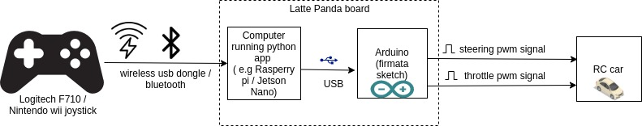
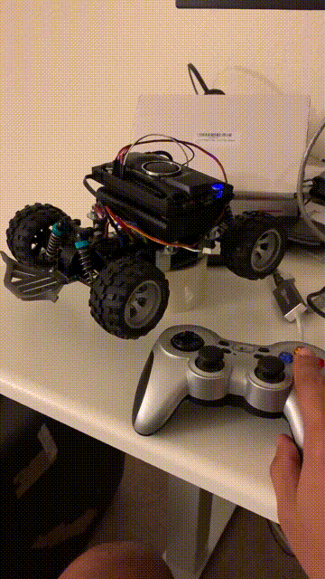

# pyRcCar: a python RC car driving app

## Intro
This repo provides an easy way to control a hobby RC car using a python application. 

The python app takes input from a joystick and controls the RC car via the arduino board as shown in the diagram. (Note that the arduino board runs the standard [firmata](https://www.arduino.cc/en/reference/firmata) sketch)

Refer to the below block diagram to understand where things fits in. 




## Result



Here I am using the 188$ [Latte Panda Delta (LP-D)](https://www.lattepanda.com/products/lattepanda-delta-432.html) board (quad core Intel(R) Celeron(R) N4100 CPU and 4GB RAM).  As shown in the block-diagram above LattePanda combines both the x86 CPU and the Connected Arduino into a single board. The board is enclosed into a [nice case](https://www.dfrobot.com/product-1852.html) and is powered by a [USB-C PD battery](https://www.asus.com/Phone-Accessories/ZenPower-Pro-PD/) which is sandwiched between the RC car chasis and the LP-D board (using poster putty for now:-))

## Drive instructions
- Calibrate the car by adjusting the PWM limits and Arduino channels in [config.py](./config.py) file
- ssh into the car computer
- Put the car in a safe plave where wheels are not touching the ground
- Start [js_drive.py](./js_drive.py) via `sudo python3 js_drive.py`
```bash
jithu@jithu-lp:~/master/pred_mt/lp/v2_dky$ sudo python3 js_drive.py
loading config file: config.py
final settings:

config loaded
Adding part LogitechJoystickController.

pymata_aio Version 2.33	Copyright (c) 2015-2018 Alan Yorinks All rights reserved.

Using COM Port:/dev/ttyACM0

Initializing Arduino - Please wait... 
Arduino Firmware ID: 2.5 StandardFirmata.ino
Auto-discovery complete. Found 30 Digital Pins and 12 Analog Pins


PWM Steering created
Init ESC
PWM Throttle created
Adding part PWMSteering.
Adding part PWMThrottle.
Opening /dev/input/js0...
Starting vehicle at 20 Hz
Device name: Logitech Gamepad F710
```

## Acknowledgemets
This project is based on the awesome [donkeycar](https://www.donkeycar.com/) project, which is a self driving library for such RC cars. Here are the differences
- Simplifies the learning curve by removing bulk of the stuff (self driving related) from donkeycar project. This makes it easy for a maker to tinker and experiment with the car.
- Adds support for Arduino boards. Donkeycar primarily needs boards having physical pins (for i2c bus like raspberry Pi / Jetson nano). (I intend to contribute arduino stuff back to donkey project once it is mature)

Originally I got interested in self driving RC cars from this [project](https://blog.davidsingleton.org/nnrccar/)